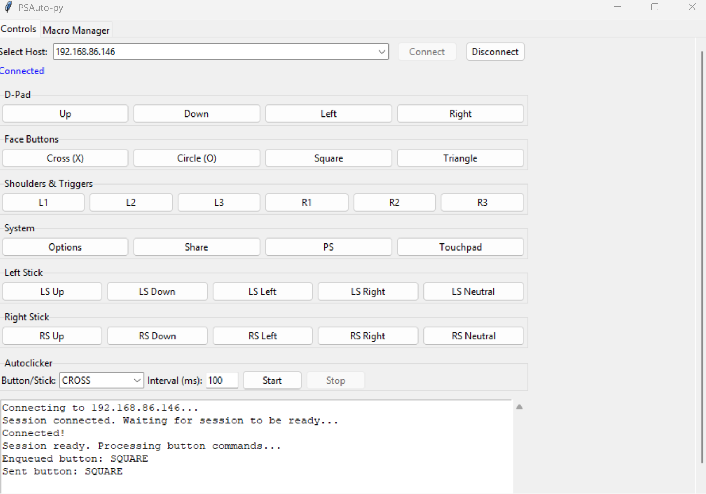
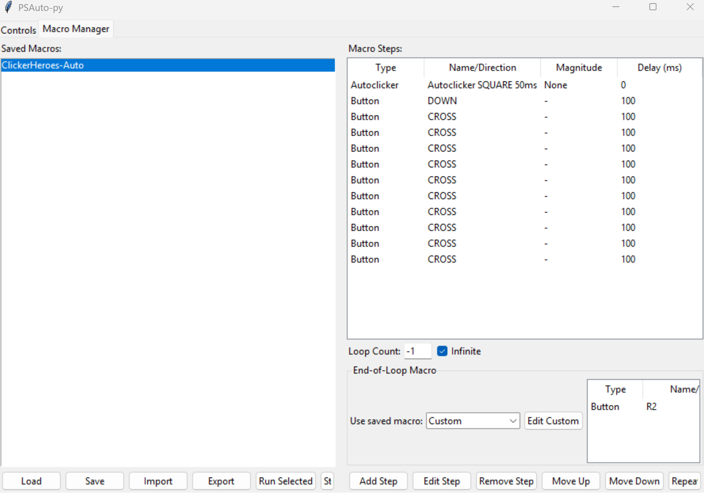

# PSAuto-py

A modular, user-friendly Python GUI for automating PlayStation 4 and 5 Remote Play using the [pyremoteplay](https://github.com/ktnrg45/pyremoteplay) library. PS4/5 Autoclicker and Macro Tool (PSAuto-py) is designed for advanced automation, clicker games, and macro scripting, with a modern interface

---

## Features
- **Modern Tkinter GUI**: Easy host selection, connection, and log feedback
- **Manual Controls**: All PlayStation buttons and sticks
- **Autoclicker**: Spam any button/stick at a custom interval
- **Macro Manager**: Build, save, import/export, and run complex macros
- **Macro Looping**: Repeat macros a set number of times or infinitely
- **End-of-Loop Macro**: Run a custom or saved macro after each main loop (e.g., to change floors in a clicker game)

---

## Installation & Setup

1. **Clone the repo**
2. (Recommended) Set up a Python 3.10+ virtual environment
3. Install dependencies:
   ```sh
   pip install -r requirements.txt
   ```
4. Register your PSN account and link to your Remote Play host (see pyremoteplay docs)
5. Run the GUI:
   ```sh
   python -m psautoclicker.gui.app
   # or
   python psautoclicker/main.py
   ```

on windows is open_main.py.bat

You must install pyremoteplay manually before this will work! 

python -m pyremoteplay IPHERE --register is the command to run in terminal after install pyremote play with pip install pyremoteplay

---

## Using the GUI

1. **Select your host** and connect
2. **Manual Controls**: Use the Controls tab to send button/stick presses
3. **Autoclicker**: Choose a button/stick, set interval, and start/stop autoclicking
4. **Macro Manager**:
   - Build macros by adding steps (button, stick, or autoclicker)
   - Set loop count (number of times to repeat the macro)
   - (Optional) Set an "End-of-Loop Macro" (runs after each main loop)
   - Save, import, export, and run macros

> **Screenshots:**
> 
> 
> 
> 
> 
> (Screenshots will appear here after running the screenshot generator.)

---

## 📸 Generating README Screenshots

This project uses an automated tool to ensure all GUI screenshots in the README are up to date and consistent:

1. **Run `generateScreenshots.py`**
   - This script will read the README, find all screenshot placeholders, and prompt you to paste images for each section.
   - Screenshots are saved to the `screenshots/` folder with filenames matching the section names (e.g., `MainWindow.png`).
2. **Paste images as prompted**
   - Use your OS screenshot tool (e.g., Snipping Tool, Print Screen) and paste (Ctrl+V) into the app for each section.
   - Click "Save Screenshot" for each.
   - You can skip sections and return later.
3. **Commit the updated screenshots and README**
   - The README will automatically display the new images from the `screenshots/` folder.

**Note:** The `screenshots/` folder is required and will be created automatically if missing.

---

## Example: Automating Clicker Heroes

Suppose you want to automate Clicker Heroes:
- **Spam SQUARE** every 50ms (to attack)
- **Every loop**: Press DOWN (move in upgrade list), then CROSS 10 times (buy upgrades)
- **After 10 loops**: Press R2 (change floors)

### Step-by-step:
1. **Import the example macro**: `Macros/ClickerHeroes-Auto.macro.json` (provided)
2. In Macro Manager, select `ClickerHeroes-Auto` in the macro list
3. The macro steps will show:
   - Autoclicker SQUARE every 50ms
   - DOWN, then CROSS x10 (100ms apart)
   - Loop count: set to 10
   - End-of-Loop Macro: R2 (200ms delay)
4. Click **Run Macro**

**What happens:**
- SQUARE is spammed every 50ms
- Each loop: DOWN, then CROSS x10
- After 10 loops, R2 is pressed to change floors, then the macro repeats (if set to infinite)

---

## Understanding Macro Looping & End-of-Loop Macro

- **Loop Count**: How many times to repeat the main macro steps (set in Macro Manager)
- **End-of-Loop Macro**: After each main loop, the selected macro (or custom steps) are run. Useful for actions like changing floors, resetting, etc.
- You can select any saved macro as the end-of-loop macro, or build a custom one.

**Visual Example:**
```
[Main Macro Steps] x Loop Count
   ↓
[End-of-Loop Macro]
   ↓
(repeat if infinite)
```

---

## Manually Creating Macro JSON Files

Macros are JSON files with this structure:
```json
{
  "name": "MyMacro",
  "steps": [
    ["BUTTON_NAME", delay_ms],
    [["STICK_NAME", "DIRECTION", magnitude], delay_ms],
    [{"type": "autoclicker", "button": "BUTTON_NAME", "interval": ms, "duration": ms/null}, delay_ms]
  ],
  "end_of_loop_macro": [ ["BUTTON_NAME", delay_ms] ],
  "end_of_loop_macro_name": null
}
```
- **steps**: List of [action, delay] pairs
- **action**: Button name (e.g., "CROSS"), stick tuple, or autoclicker dict
- **delay**: Milliseconds to wait after the action
- **end_of_loop_macro**: Steps to run after each main loop (optional)
- **end_of_loop_macro_name**: Name of a saved macro to use as end-of-loop macro (optional)

See [Macros/ClickerHeroes-Auto.macro.json](Macros/ClickerHeroes-Auto.macro.json) for a real example.

## PlayStation Button and Stick Options for Macros

You can use the following button names in your macro JSON files (case-insensitive):

**Standard Buttons:**
- CROSS
- CIRCLE
- SQUARE
- TRIANGLE
- L1, L2, L3
- R1, R2, R3
- UP, DOWN, LEFT, RIGHT (D-Pad)
- OPTIONS
- SHARE
- PS
- TOUCHPAD

**Sticks:**
- LEFT_STICK, RIGHT_STICK
  - Use as a tuple: ["LEFT_STICK", "UP", 1.0] (move left stick up fully)
  - Directions: UP, DOWN, LEFT, RIGHT, NEUTRAL
  - Magnitude: -1.0 to 1.0 (float)

**Autoclicker Example:**
```json
[{"type": "autoclicker", "button": "SQUARE", "interval": 50, "duration": null}, 0]
```

**Stick Example:**
```json
[["LEFT_STICK", "UP", 1.0], 100]
```

**Button Example:**
```json
["CROSS", 100]
```

You can mix and match these in your macro steps. See the [ClickerHeroes-Auto.macro.json](Macros/ClickerHeroes-Auto.macro.json) for a real-world example.

### What is "Magnitude" in Stick Steps?

**Magnitude** controls how far the analog stick is pushed in a given direction:
- It is a float value between **-1.0** and **1.0**.
- **1.0** = stick fully pushed in the specified direction
- **0.0** = stick centered (neutral)
- **-1.0** = stick fully pushed in the opposite direction (for UP/DOWN or LEFT/RIGHT)

| Direction | Magnitude | Effect                               |
|-----------|-----------|--------------------------------------|
| UP        | 1.0       | Stick fully up                       |
| DOWN      | 1.0       | Stick fully down                     |
| LEFT      | 1.0       | Stick fully left                     |
| RIGHT     | 1.0       | Stick fully right                    |
| UP        | 0.5       | Stick half-way up                    |
| LEFT      | -1.0      | Stick fully right (opposite of left) |
| NEUTRAL   | 0.0       | Stick centered (no movement)         |

**Examples:**
```json
[["LEFT_STICK", "UP", 1.0], 100]      // Push left stick fully up for 100ms
[["RIGHT_STICK", "LEFT", 0.5], 200]   // Push right stick half-way left for 200ms
[["LEFT_STICK", "NEUTRAL", 0.0], 50]  // Center the left stick for 50ms
```

For most games, use **1.0** for a full push in the direction. Use values between 0.0 and 1.0 for partial movement (e.g., slow walk). Use **NEUTRAL** and 0.0 to return the stick to center.

---

## Troubleshooting & FAQ

- **Macro steps not showing?** Make sure to select the macro in the list and click "Load" (or just select it).
- **Can't connect to host?** Ensure your PSN account is registered and linked first using python -m pyremoteplay IPHERE --register check out the pyremoteplay docss for more info

- **Autoclicker not working?** Check that you are connected and the interval is not too low (<40ms may be ignored).
- **Need more examples?** See the `Macros/` folder or ask submit more with a pull request. Lets make a community repo!

---